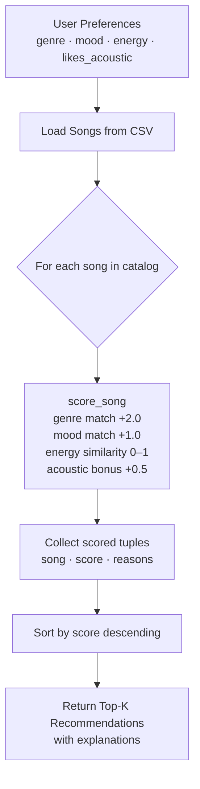

# 🎵 Music Recommender Simulation

## Project Summary

This project builds a simple content-based music recommender from scratch. A catalog of 20 songs is scored against a user "taste profile" using weighted rules for genre, mood, and energy. The system returns a ranked list of suggestions with plain-language explanations so every recommendation is transparent and understandable.

---

## How The System Works

### Real-World Context

Real recommenders like Spotify or YouTube learn from millions of listening events and use collaborative filtering (comparing your taste to other users) as well as content-based signals (audio features of the songs themselves). At scale they also incorporate context (time of day, device, mood signals) and retrain constantly. This simulation focuses only on content-based scoring so the logic stays readable and inspectable.

### Features Used

**Song** attributes considered by the scorer:
- `genre` – categorical label (pop, rock, lofi, jazz, edm, ambient, …)
- `mood` – categorical label (happy, chill, intense, relaxed, moody, focused, …)
- `energy` – float 0.0–1.0, how energetic the track feels
- `acousticness` – float 0.0–1.0, used as a bonus for users who prefer acoustic sounds

**UserProfile** fields:
- `favorite_genre` – string, matched against song genre
- `favorite_mood` – string, matched against song mood
- `target_energy` – float 0.0–1.0, desired energy level
- `likes_acoustic` – boolean, opt-in acoustic bonus

### Algorithm Recipe

```
score = 0
if song.genre == user.favorite_genre   → +2.0  (genre match)
if song.mood  == user.favorite_mood    → +1.0  (mood match)
score += 1.0 − |song.energy − user.target_energy|  (energy proximity, 0.0–1.0)
if user.likes_acoustic and song.acousticness ≥ 0.6 → +0.5
```

Genre carries the highest weight because it is the coarsest filter—a rock fan and a lofi fan have fundamentally different catalogs. Mood is worth half as much because mood can overlap across genres (a "chill" pop song and a "chill" jazz song both appeal to the same listener). Energy is a continuous score so it always contributes something without creating hard cutoffs. The acoustic bonus is optional and small so it nudges without dominating.

### Data Flow (Mermaid Flowchart)



### Potential Biases

This system might over-prioritize genre because it carries double the weight of mood, which means a wrong-genre but perfect-mood-and-energy song will almost never appear in results. Genres that appear more frequently in the catalog (e.g., lofi with 3 entries) will dominate recommendations for lofi users but under-serve users of rarer genres.

---

## Getting Started

### Setup

1. Create a virtual environment (optional but recommended):

   ```bash
   python -m venv .venv
   source .venv/bin/activate      # Mac or Linux
   .venv\Scripts\activate         # Windows
   ```

2. Install dependencies:

   ```bash
   pip install -r requirements.txt
   ```

3. Run the app:

   ```bash
   PYTHONPATH=src python -m src.main
   ```

### Running Tests

```bash
pytest
```

You can add more tests in `tests/test_recommender.py`.

---

## Experiments You Tried

- **Baseline (genre=2.0, mood=1.0, energy proximity):** Results feel intuitive—pop-happy profiles surface energetic pop tracks; chill-lofi profiles surface quiet lofi tracks.
- **Weight shift (genre doubled to 4.0):** Genre match completely dominates. A rock song with mismatched mood/energy still outranks a perfect mood+energy song from a different genre.
- **Mood removed (commented out):** Rankings shifted noticeably for "chill lofi" because several lofi songs are labelled "focused" rather than "chill"—they dropped in rank even though they would intuitively fit.
- **Acoustic bonus enabled vs. disabled:** Makes a clear difference for ambient/acoustic catalogs; has no effect on EDM/rock profiles because those songs have very low acousticness values.

---

## Limitations and Risks

- Catalog is only 20 songs—results can feel repetitive
- No understanding of lyrics, artist popularity, or listening history
- Genre matching is case-sensitive and exact; "Indie Pop" ≠ "indie pop" unless both are lowercased
- Energy proximity can produce odd ties when many songs cluster around 0.4–0.5
- System treats all users as having a single fixed taste; no temporal or contextual variation

---

## Reflection

See the complete **[Model Card](model_card.md)** for algorithm details, bias analysis, and evaluation results.

Building this recommender made clear how much of what feels like "magic" in real apps is actually straightforward arithmetic—just done at enormous scale with far richer features. The surprising moment was discovering how a single weight choice (genre at 2.0 vs. 1.0) can completely change the character of a recommendation list. AI tools accelerated the boilerplate (CSV parsing, scoring loops) but every weight and rule still required a deliberate design decision that the AI could not make on its own.